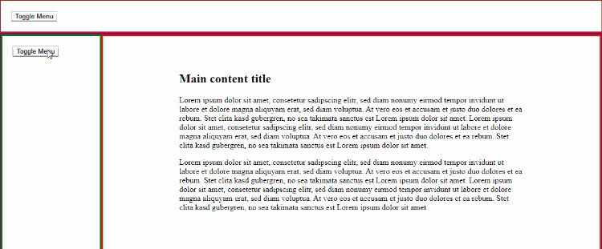
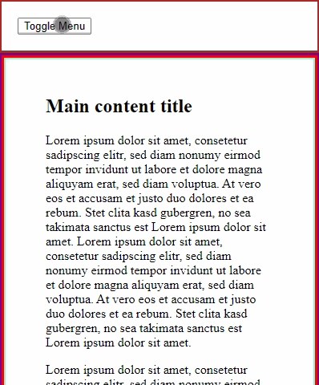

# `embedded-navigation-drawer`

Example for a embedded responsive drawer navigation that can be used an all page levels. In desktop mode the drawer pushes the main content the the side. In mobile mode the drawer is an overlay over the main content.

The following picture shows the behaviour of the drawer in desktop mode:

And this picture shows the behaviour in mobile mode:

This project is bootstrapped by [aurelia-cli](https://github.com/aurelia/cli).

## Run the app

1. Run `npm ci` to install all required npm dependencies

2. Run `au run`, then open `http://localhost:8080`

To open browser automatically, do `au run --open`.

To change dev server port, do `au run --port 8888`.

To enable Webpack Bundle Analyzer, do `au run --analyze`.

To enable hot module reload, do `au run --hmr`.
